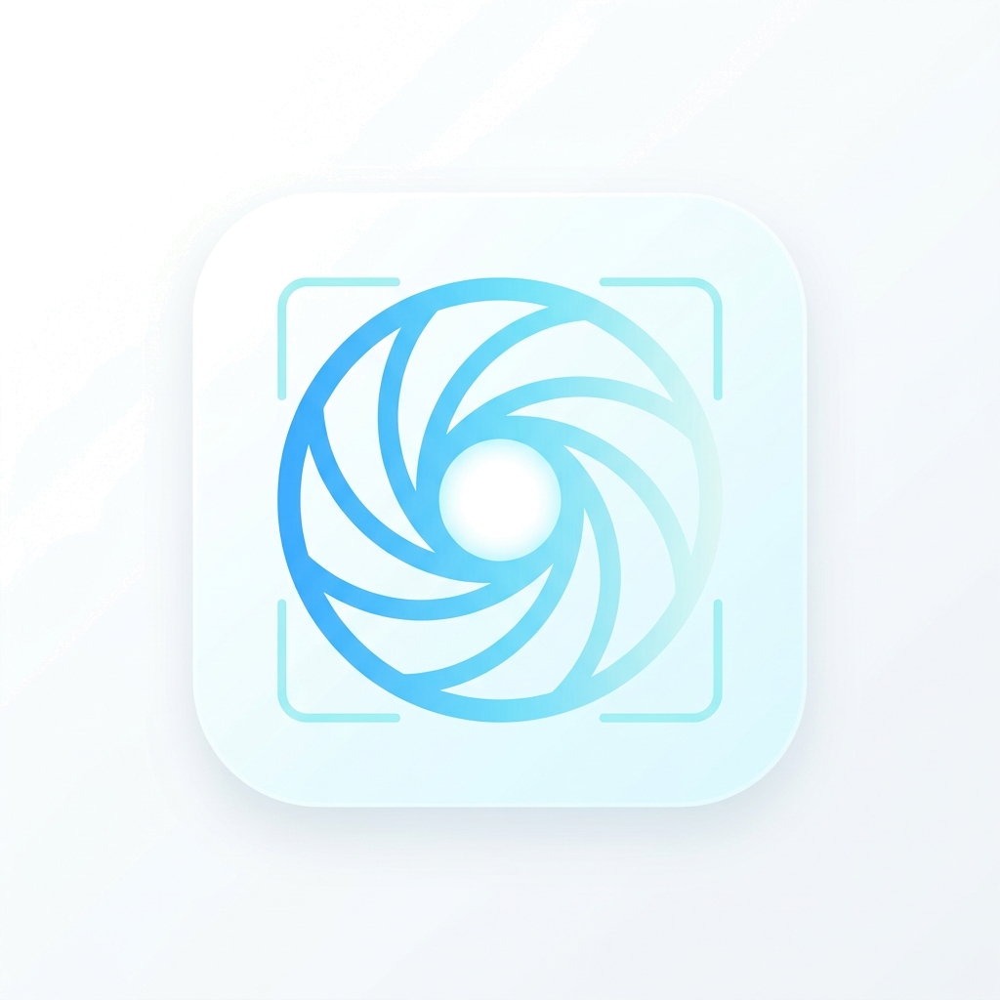

<p align="center">
  
</p>

# Snapset

**Snapset** は、開発者やデザイナー、コンテンツクリエイターのために設計された、高精度なスクリーンショットツールです。
単なるキャプチャツールではなく、**「ターゲット解像度への自動リサイズ」「アスペクト比の維持」「個人情報の塗りつぶし」「プロフェッショナルな枠線追加」**を一気通貫で行うことができます。

## ✨ 主な機能

- 📍 **直感的な範囲選択**: 専用のオーバーレイウィンドウで、撮影範囲をピクセル単位で正確に指定。
- 📐 **アスペクト比の固定**: 16:9 や 1:1 など、ターゲットに合わせた比率を保ったまま範囲を選択可能。
- 🖼️ **高品質な枠線 (Border)**: 任意の太さと色の枠線を、出力サイズを維持したまま追加。
- 🕵️ **高度なマスキング**: プレビュー上でドラッグするだけで、パスワードや個人情報を塗りつぶし（黒塗り等）可能。
- 📏 **ターゲットリサイズ**: 元のキャプチャサイズに関わらず、指定した解像度（例: 1920x1080）に自動で高品質リサイズ。
- 🚀 **マルチプラットフォーム**: Electron製で、macOS (Apple Silicon対応) と Windows でシームレスに動作。

## 📦 インストール方法

### macOS

#### Homebrew でインストール (推奨)
```bash
brew install --cask blue1st/taps/snapset
```

#### 手動インストール
1. [GitHub Releases](https://github.com/blue1st/snapset/releases) ページにアクセスします。
2. 最新の `snapset-x.x.x-arm64.dmg`（Apple Silicon用）をダウンロードします。
3. DMGを開き、**Snapset** を **アプリケーション** フォルダにドラッグ＆ドロップしてください。

### Windows

1. [GitHub Releases](https://github.com/blue1st/snapset/releases) ページにアクセスします。
2. 最新の `snapset-setup-x.x.x.exe` をダウンロードします。
3. インストーラーを実行し、画面の指示に従ってインストールを完了させてください。

## 🚀 使い方

1. **アプリを起動**: Snapsetを起動します。
2. **出力設定**: 最終的な解像度（幅・高さ）を入力し、必要に応じて「縦横比を固定」をチェックします。
3. **範囲を選択**: **📍 マウスで撮影範囲を選択する** ボタンをクリック。
   - **ドラッグ**: 枠の移動
   - **マウスホイール**: サイズの拡大・縮小
   - **Enter**: 確定 / **Esc**: キャンセル
4. **プレビューと仕上げ**:
   - プレビュー画像上でドラッグすると、塗りつぶしエリア（リダクション）を追加できます。
   - 枠線の太さや色、塗りつぶしの色を調整します。
5. **保存**: **💾 画像を保存する** をクリックして書き出し。

## 🛠️ 開発者向け情報 (ビルド方法)

```bash
# クローン
git clone https://github.com/blue1st/snapset.git
cd snapset

# 依存関係のインストール
npm install

# 開発モードで起動
npm run dev

# 本番用パッケージ（dmg/exe）を生成
npm run dist
```

## 📄 ライセンス

ISC License. 詳細は `package.json` を参照してください。

---

<p align="center">
  Built with ❤️ by <a href="https://github.com/blue1st">blue1st</a>
</p>

